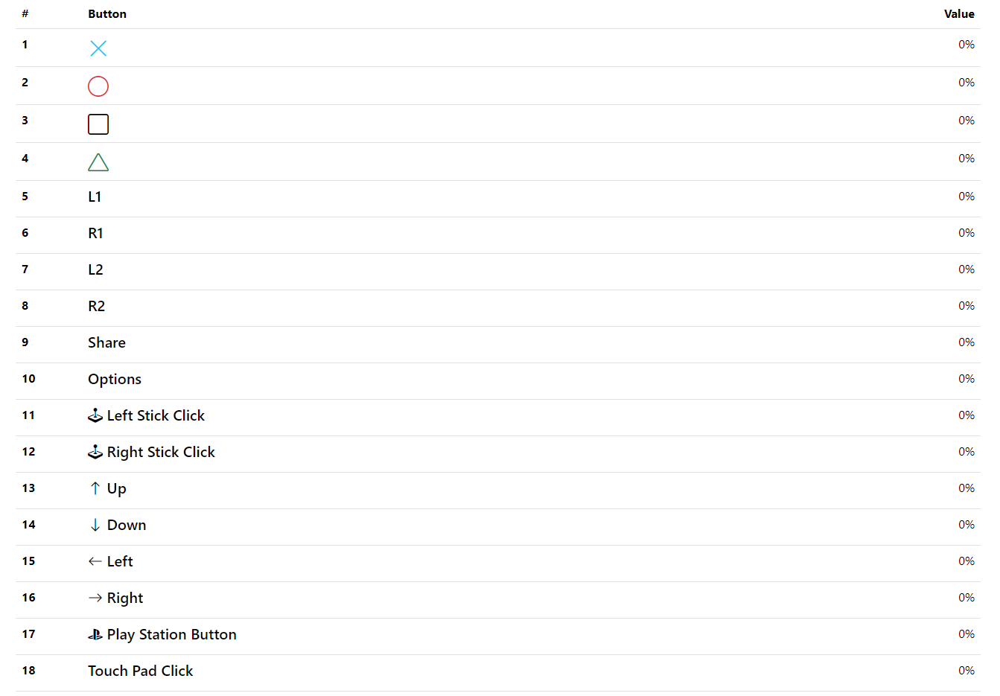
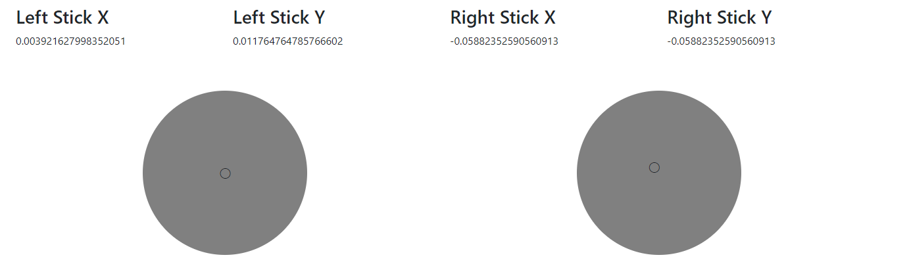
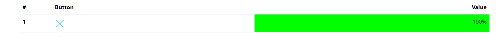
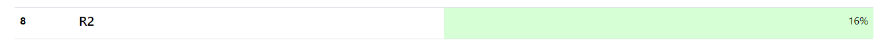
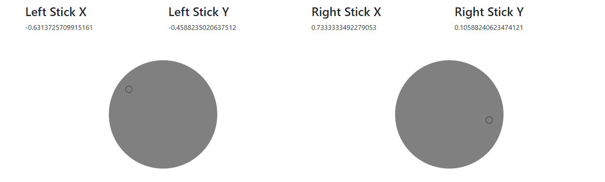
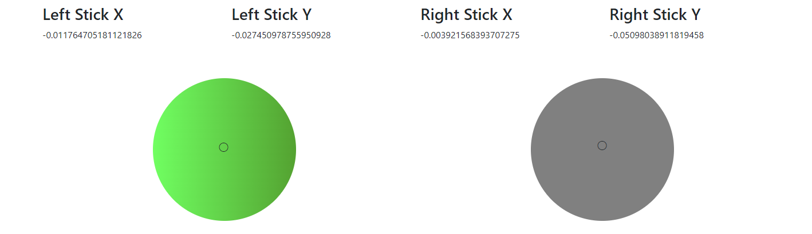

Web UI for Testing Your DualShock 4 Device: This Web UI allows you to perform tests on all buttons of your device. It provides the opportunity to check the performance of buttons that work with a click, as well as those that obtain values when pressed. You can test the responsiveness of both clickable buttons and those that register values upon pressing.

#### **Dualshock 4 Buttons**

#### **Dualshock 4 Sticks**

#### **Button 100% Pressed**

#### **Button 16% Pressed**

#### **Dualshock 4 Sticks Testing**

#### **Dualshock 4 Stick Click Test**

